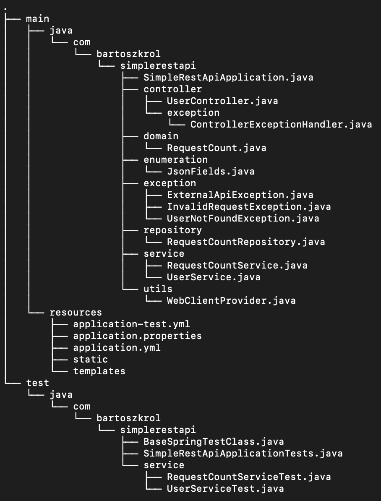

## Table of contents ##
* [General info](#general-info)
* [Technologies](#technologies)
* [Running](#running)
* [Manual](#manual)
* [Project structure](#project-structure)

## General info ##

This project is a simple REST Api that enables fetching Github users data. 

## Technologies ##

<b>Built with</b>
* [Java (jdk13.02.jdk)](https://www.java.com/)
* [Gradle](https://gradle.org)

## Running ##

Project can be imported as the Gradle project to your favorite IDE by using *build.gradle* file. Below manuals for importing file to InteliJ and Eclipse are presented:
* https://www.jetbrains.com/help/idea/gradle.html
* https://steffenschaefer.github.io/gwt-gradle-plugin/doc/latest/eclipse

To run project with Gradle in terminal you need to enter the project folder and run commands:
```
./gradlew build - this command builds project and runs tests.
./gradlew bootRun - this command runs project and allows API usage.
```
## Manual ##

The API provides one endpoint presented below:

```
GET /users/{login}
```

## Project structure ##



Project main class is *SimpleRestApiApplication*. It contains the main method of the project. 

Package *controller* contains class *UserController* responsible for providing an endpoint GET /users/{login}. In the package there is 
a subpackage exception containing class *ControllerExceptionHandler* responsible for error handling.

Package *domain* contains classes representing business domain objects. It contains one class *RequestCount* representing number of requests for 
each login.

Package *enumerations* contains enums used in the project. It contains enum *JsonFields* storing literal constants.

Package *exception* contains project specific exception classes. 

Package *repository* contains DAO objects in a form of JPA repositories. It contains interface *RequestCountRepository*.
 
Package *service* contains service classes containing business logic. 

Package *utils* contains utils classes. It contains class *WebClientProvider* providing an instance of WebClient.

## Datasource ##

Datasource used in the project is H2 database. It is accessible during the project running under url: 
{{port}}/h2-console/. To log to the database it is necessary to provide datasource credentials for a 
corresponding profile. In the case of this project corresponding credentials are in the application.yml file.
